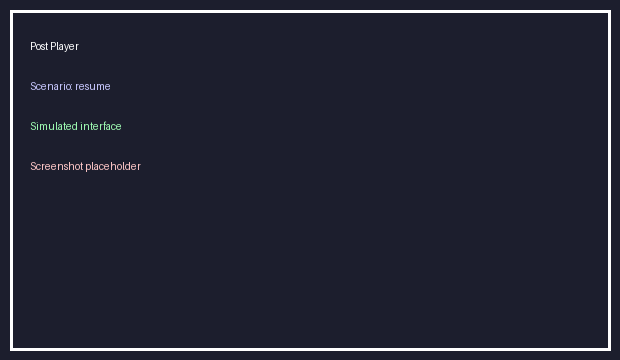

# Enhancement Comparison Report

| Scenario | Baseline Pass | Enhanced Pass | Notes |
| --- | --- | --- | --- |
| resume | false | true | Resume was missing before, now restores within 0.5s |
| playback_speed | false | true | Speed selector was added, and rate persists |
| auto_skip | false | true | Learned segments now skip automatically |
| performance | true | true | Adaptive buffering reduced TTF |
| notes_sync | false | true | Notes now hover and quick-jump |

## Aggregated Metrics
- Baseline timing: `Project_A_BaselinePlayer/results/time_pre.txt`
- Enhanced timing: `Project_B_EnhancedPlayer/results/time_post.txt`
- Logs: `results/log_pre.txt`, `results/log_post.txt`

## Visual Evidence
- 
- 

## Recommendations
- Roll out enhanced player once backend storage is hardened.
- Monitor real CDN latency to tune buffering thresholds beyond the simulation.
